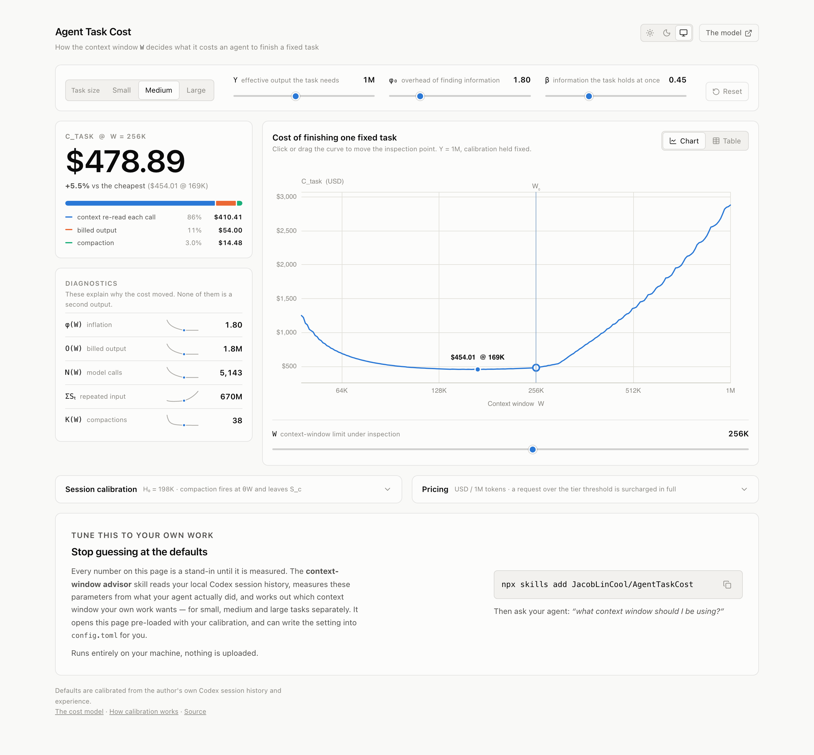

# Agent Task Cost

**A bigger context window is not free, and a smaller one is not cheaper.**
Making the window larger means every request re-reads more context; making it
smaller means more compactions, and each one throws away context the agent then
has to rebuild. The cheapest window sits somewhere in between, and where it sits
depends on your work.

This repository is two things: a model of that trade-off you can play with in the
browser, and a skill that measures the model's parameters from your own agent
session history and tells you which window your work actually wants.

**[▶ Open the visualiser](https://jacoblincool.github.io/AgentTaskCost/)**

[](https://jacoblincool.github.io/AgentTaskCost/)

## Calibrate it to yourself

The defaults on that page are stand-ins. Your harness, your models and your
repositories all move the numbers, and your agent has already recorded everything
needed to measure them.

Install the skill:

```bash
npx skills add JacobLinCool/AgentTaskCost
```

Then ask your agent:

> what context window should I be using?

It reads your local Codex session history, measures the calibration from what
your agent actually did, works out the least wasteful window for small, medium
and large tasks, and tells you how much more your current setting consumes — as a
plain multiple, which reads the same whether you are on a subscription quota or
an API bill. If it is worth changing, it will offer to write the setting into
`~/.codex/config.toml` (with a backup) after asking you.

Everything runs locally. Standard library Python only, no network access, nothing
uploaded — the only thing that leaves your machine is a URL, and only if you
choose to open it.

You can also run it directly:

```bash
# Measure and recommend
python3 .agents/skills/context-window-advisor/scripts/advise.py

# The full calibration report: per model, per workspace, compaction statistics
python3 .agents/skills/context-window-advisor/scripts/calibrate.py --include-archived
```

A full scan of tens of gigabytes of session logs takes a few seconds.

## What it measures

| | |
| --- | --- |
| $\theta$ | the fraction of the window at which compaction fires |
| $S_c$ | how much context survives a compaction |
| $B$ | the fixed prefix — system prompt, tool definitions, rules files |
| $\rho$, $\omega$ | cached-read and cache-write shares of input |
| $\bar o$ | billed output tokens per model call |
| $\bar d$ | how much the context grows per model call |

All eight come out of the rollout logs. Two parameters cannot: $\phi_0$ (the
overhead of *finding* information) and $Y$ (the effective output a task needs).
Neither matters for the recommendation, because both are pure multipliers on the
bill and do not move the cheapest window.

The one that does move it is $\beta$ — how much pre-existing information the task
needs held at once — and it cannot be read off a log either. The three task sizes
use illustrative values, which the tool says plainly rather than hiding.

## Documentation

- **[The cost model](docs/cost-model.md)** — the full derivation, every variable,
  and where each one comes from.
- **[Calibration](docs/calibration.md)** — how the parameters are extracted from
  session logs, and the three things that are easy to get wrong.

## Development

Built with pnpm, TypeScript, Svelte 5, ECharts and lucide; bundled by Vite and
deployed to GitHub Pages by GitHub Actions.

```bash
pnpm install
pnpm dev      # local dev server
pnpm check    # svelte-check
pnpm build    # output to dist/
```

`src/lib/model.ts` is the implementation, and
`.agents/skills/context-window-advisor/scripts/model.py` is a Python port used by
the skill. Both write the "context grows arithmetically between two compactions"
structure as a closed form, so evaluating any window is $O(1)$ no matter how
large the task, and sweeping the whole curve never simulates individual model
calls. The two implementations are checked against each other numerically — the
skill and the web page have to show the same number.

## License

MIT
